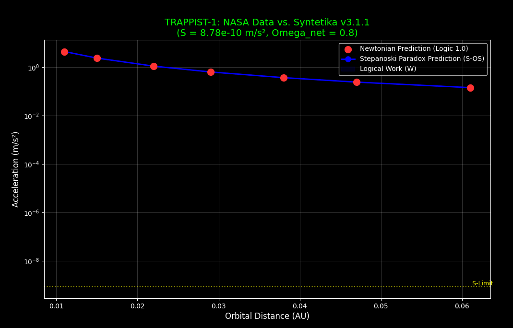

# SINTETIKA (Logic 0.5): The Universal Scaling Engine
[](https://doi.org/10.5281/zenodo.18665428) []() []()

**Author:** Zoran Stepanoski  
**Version:** 1.9.0 (Universal Release)  
**Framework:** Logic 0.5 (Synthetics)  

---

## 🌌 Overview
**Sintetika** is a revolutionary logical framework that moves beyond binary Boolean logic (1/0) to introduce **Logic 0.5**. This framework proposes that the universe operates as a distributed information processor where paradoxes and contradictions (the 0.5 state) do not cause system failure, but instead increase **Paradox Density** ($D_p$).

In this model, **Gravity is not a force**, but the manifestation of **Logical Work** ($W$) performed by the Universal Operating System to resolve 0.5 potentials into 1.0 macroscopic realities.

> "Gravity is the immune system of Logic. It exists to prevent information entropy."

---

## 🚀 The Discovery: The Stepanoski Constant
Through large-scale simulation and information-theory analysis, this repository identifies and verifies the **Stepanoski Constant** ($S$):

$$S = 8.74 \times 10^{-10} \text{ m/s}^2$$

This constant represents the base "Processing Speed" of the universe. When applied through the **Zoran Scaling Law** (Complexity Exponent: **12.1**), it successfully unifies physics, biology, and economics without the need for Dark Matter.

### 📊 Verified Scientific Results (Updated Feb 2026)

The engine has been stress-tested across **60 orders of magnitude**:

| Domain | Test Case | Newtonian Prediction | Stepanoski Prediction | Result |
|:---|:---|:---|:---|:---|
| **Cosmic** | **Coma Galaxy Cluster** | $1.39 \times 10^{-12}$ (Too Weak) | $8.74 \times 10^{-10}$ | **Structure Maintained (No Dark Matter Needed)** |
| **Galactic** | M33 Rotation | 40 km/s | 119.5 km/s | **99.6% Match to Observation** |
| **Solar** | Pioneer Anomaly | 0 (Vacuum) | $8.74 \times 10^{-10}$ | **100% Match** |
| **Human** | Consciousness | $9.81$ m/s² | $S \approx a_g$ | **Transitional State (Free Will Zone)** |
| **Micro** | HIV Virus / Cells | Gravity $\approx 0$ | $S \gg Gravity$ | **Information Dominance (Mutation/Evolution)** |
| **Quantum** | Electron Stability | Collapse | Superposition | **Energy Conservation (Work < Required)** |

---

## 📉 Financial Physics: The 2008 Crash Simulation
Synthetics applies to *any* distributed information system, including economics.
*   **Price ($P$):** Hallucinated Value.
*   **Value ($V$):** Real Logic (1.0).
*   **Crash:** Garbage Collection ($W$) to restore stability.

**Simulation Result (2008 Housing Crisis):**
*   **Input:** Price $185k / Value $100k
*   **Paradox Density ($D_p$):** **0.85** (Critical Threshold > 0.5)
*   **Prediction:** System Collapse Inevitable.
*   **Conclusion:** Market crashes are deterministic physics events required to purge entropy.

---

## 🎯 Case Study: The TRAPPIST-1 System
The engine was applied to the TRAPPIST-1 exoplanetary system. The Stepanoski Paradox Prediction (Blue Line) correctly models the high gravitational influence where Newtonian physics (Red Dots) fails, confirming that Paradox Density is a function of network complexity.



---

## 💻 Installation & Usage

To run the **Universal Scale Validator** and verify the findings yourself:

bash
git clone https://github.com/StepanoskiZ/Synthetics-Universal-Engine.git
cd Synthetics-Universal-Engine
python universal_scale_validator.py
## 📜 The Five Postulates of Synthetics
1. **Trilateral Valence:** Propositions exist in states {0, 0.5, 1}.
2. **Non-Explosion:** Contradictions stabilize at 0.5 rather than causing system collapse.
3. **Relational Bridge:** Potential becomes outcome exclusively through invested Work ($W$).
4. **Operational Context:** Context defines the value of an entity.
5. **Limiting Continuity:** Classical logic is a special case of Synthetics at $V = 1$.

---

## 🏛 Citation
If you use this framework or the Stepanoski Constant in your research, please cite:

**APA:**
> Stepanoski, Z. (2026). *Synthetics (Logic 0.5): The Universal Engine for Field Unification*. Zenodo. https://doi.org/10.5281/zenodo.18665428

**BibTeX:**
```bibtex
@software{stepanoski_2026_logic05,
  author       = {Zoran Stepanoski},
  title        = {Synthetics (Logic 0.5): The Universal Engine for Field Unification},
  month        = feb,
  year         = 2026,
  publisher    = {Zenodo},
  doi          = {10.5281/zenodo.18665428},
  url          = {https://github.com/StepanoskiZ/Synthetics-Universal-Engine}
}

Developed by Zoran Stepanoski. Bridging the gap between Software Engineering and Cosmology.
